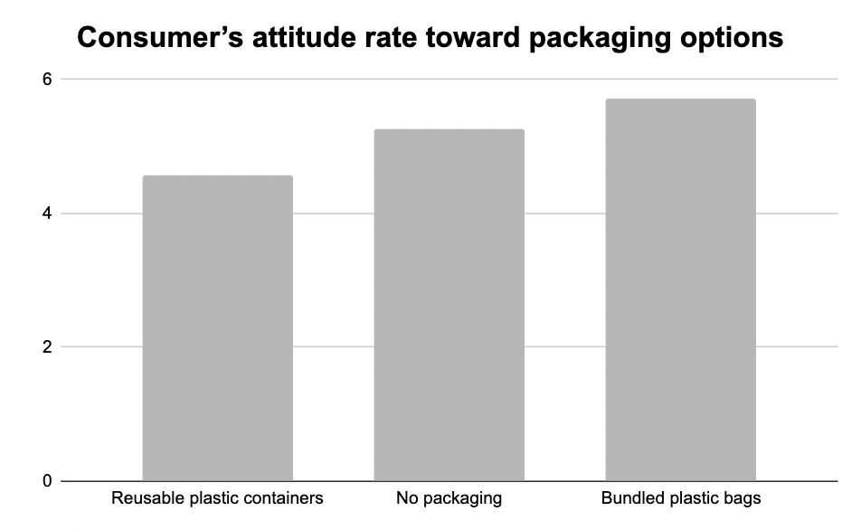
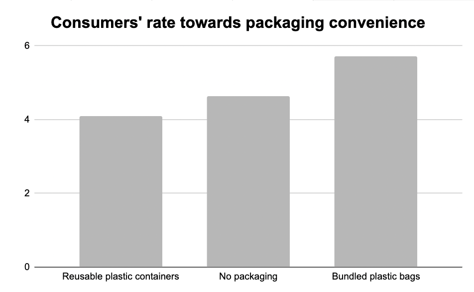
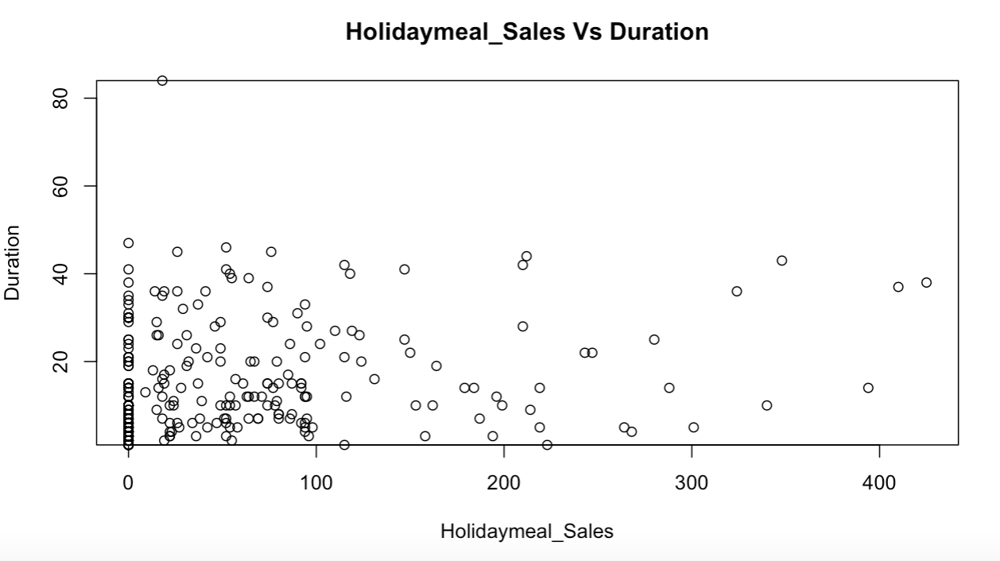

# Suggest-Packaging-Technique-For-A Deliver-Meal-Kit-Firm

## Getting Started

These instructions will get you a copy of the project up and running on your local machine for development and testing purposes.

### Prerequisites

What R packages you need to install the software and how to install them

* R version 4.2.1
* library(psych)
* library(epiDisplay)

### Built With

* [R](https://www.r-project.org/) - Programming Language
* [tidyverse](https://www.tidyverse.org/) - Data Manipulation and Visualization

# 1. Introduction

The given firm is testing new packaging techniques for their meal kit delivery service and is trying to strike a balance between both consumers’ preferences and cost effectiveness. Three packaging options are tested:

* Packaging Option 1: Reusable plastic containers in which ingredients are stored. For example, broccoli would come in a plastic container, potatoes in another, etc. Consumers return the plastic containers by leaving them outside for the company to pick up. The containers are labeled so that the consumers know which items correspond with each meal.
* Packaging Option 2: No packaging is used. Ingredients are placed in the box. For example, broccoli would just be set in the box as well as potatoes and other ingredients. Consumers must determine which items go with each meal.
* Packaging Option 3: All ingredients for each meal are bundled in plastic bags. Thus, consumers do not need to determine which items go with each meal/recipe.

All of the meal kits will be delivered in a cardboard box and all prepackaged items such as sauces, meats, cheeses will be in their individual packages. However, the company is trying to determine the best way to deliver the other ingredients (e.g. vegetables, bread, etc.) within that box.

300 current subscribers are selected randomly and assigned to one of the three aforementioned conditions (packaging options). After delivering their meals for 6 months with the new packaging formats, participants are provided with a survey via email to obtain their feedback. The data from the experiment and survey appears below and includes the variables: Packaging through Convenience.

This data is merged with existing data that we have on these consumers (Variables: Meals through Holidaymeal_Sales17, see below).

Option 1 is the most expensive, while Option 2 is the least expensive to produce.

In the last two years, the firm has started to offer additional items for purchase that are relevant to cooking (for example, aprons, pots, pans, etc.). Sales of these items are labeled addon_sales in the dataset. Similarly, the company offers special promotions during the holiday season and consumers have the option of purchasing additional holiday themed meals (again, this is in addition to their weekly meals). Sales of these items are labeled holidaymeal_sales in the dataset.

In this project, my task is to draw useful insights while exploring interesting patterns. I develop hypothesis then use the statistical tests like ANOVA, MANOVA, t-test to test.

## 1.1 Data Description

* Packaging: 1 – option 1, 2- option 2, 3– option 3
* Attitudes: consumers rated their overall attitude toward the packaging
* Environment: consumers rated their agreement with if the packaging was good for the environment
* Convenience: consumers rated their perceptions of the convenience of the packaging
* Meals: 0-consumer receives 3 meals a week, 1- consumer receives 5 meals a week
* Duration: number of months as a subscriber (prior to the start of the experiment)
* Addon_Sales16: Amount in dollars of add-on items purchased in 2016
* Addon_Sales17: Amount in dollars of add-on items purchased in 2017
* Holidaymeal_Sales16: Amount in dollars of holiday meals purchased in 2016
* Holidaymeal_Sales17: Amount in dollars of holiday meals purchased in 2017

## 1.2 Importing the required libraries

* library(psych)
* library(epiDisplay)

# 2. Analytical Questions

## 2.1 Recommend an option that pleases the consumer

### Run One way ANOVA and bonferroni adjustment on packaging options vs attitute rate

#### IV = Packaging, DV = Attitudes

A one-way ANOVA shows a significant effect of packaging on attitude rate (F(2, 256) = 14.99, p < 0.05). Post hoc analysis indicate that packaging 1 resulted in significantly lower attitude rate (M = 4.58, SD = 1.43) compared to packaging 2 (M = 5.26, SD = 1.32; p < 0.05) and packaging 3 (M = 5.72, SD = 1.37; p < 0.05). Packaging 2 are also significantly lower than packaging 3 (p < 0.05)

### Run one way ANOVA on packaging options vs convenience rate

#### IV = Packaging, DV = Convenience

Results for a one-way ANOVA show a significant difference for convenience rate towards packaging options (F(2, 256) = 31.29, p < 0.05). Post hoc analysis indicate that packaging 1 resulted in significantly lower convenience rate (M = 4.09, SD = 1.40) compared to packaging 2 (M = 4.64, SD = 1.38; p < 0.05) and packaging 3 (M = 5.72, SD = 1.33; p < 0.05). Packaging 2 are also significantly lower than packaging 3 (p < 0.05)

**Conclusion: According to the analysis, Packaging 3 receives the highest rate from customers in terms of preference, so the firm should goes for option 3**

## 2.2 Compare 2 groups of subscribers who have a 3 meal a week plan versus who subscribe to a 5 meal a week plan. Further, determine if individuals are more likely to have add-on sales or purchase holiday meals based on their subscriber status (3 v. 5 meals per week)

### Compare 3 meal plan vs 5 meal plan

library(epiDisplay)
tab1(Mealkits$Meals, sort.group = "decreasing", cum.percent = TRUE)

Comparing 2 groups, group 1 (5 meals a week) has higher number of subscribers than group 0 (3 meals a week)

### Run one way MANOVA on 2 groups of meal plan vs add on sales, holiday sales

#### IV = Meals, DV = Addon_Sales17, Holidaymeal_Sales17

Results for a one-way MANOVA (Wilks’ Lambda = 0.98; F(1, 298) = 2.26, p = 0.1) indicate there is no significant difference for add-on sales and holiday meal sales towards meal plan option

**Conclusion: According to the analysis, 5 meal plan has higher subscribers than 3 meal plan, however subscribers meal plan option has no impact on the sales of add-on or holiday meal for the firm, so there is no need to put more promotion on any specific meal plan option**

## 2.3 Determine if length of time as a subscriber has any influence on the sale of additional items or holiday meals

### Regression add-on sales vs duration

The results of a regression analysis suggest that the model was no significant difference (p = 0.74) between add-on sales 2017 vs duration of subscribers.

### Regression Holidaymeal_Sales vs duration

The results of a regression analysis suggest that the model was significant (F(1, 298) = 14.42, p < 0.01), with duration explaining 4.6% of the variance in holiday sales. Specifically, duration had a significant influence on holiday sales (b = 1.40, p < 0.01).

## Switch the focus on add-on sales or holiday sale
### Paired sample t-test 
#### Add-on sales 16 vs 17
Results suggest no significant difference for add-on sales between 2016 and 2017 (t(299) = 0.22, p = 0.8). 

#### Holidaymeal sales 16 vs 17
Results suggest a significant difference for holiday sales between 2016 and 2017 (t(299) = -4.40, p < 0.05). Sales for holidaymeal in 2016 is significantly lower  (M = 36.38, SD = 61.02) than 2017 (M = 51.16, SD = 78.65).

**Conclusion: According to the analysis, Duration has significant impact on holiday meal sales, and holiday meal sales is rising from 2016 to 2017, so it's worth nurture subcribers loyalty to increase holiday sales**